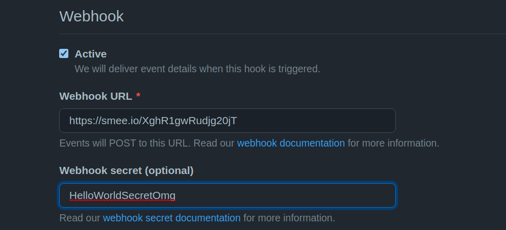
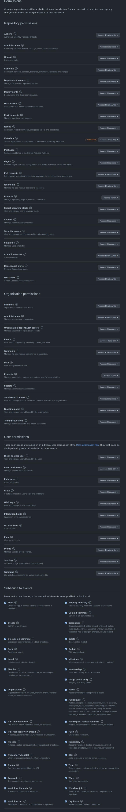
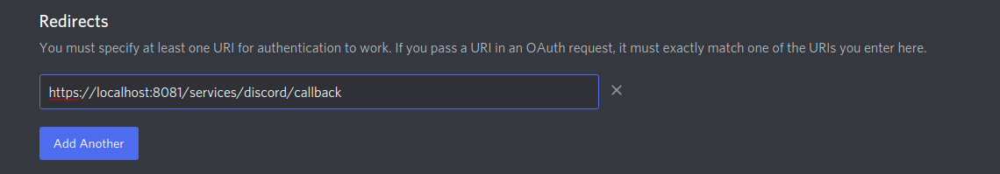
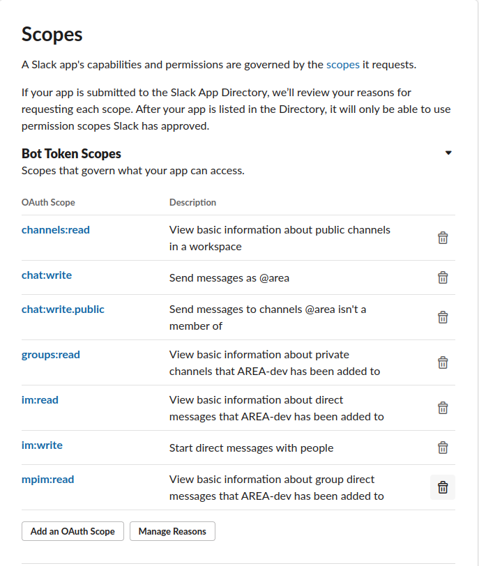
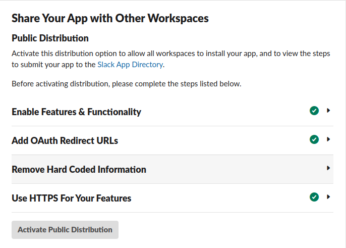
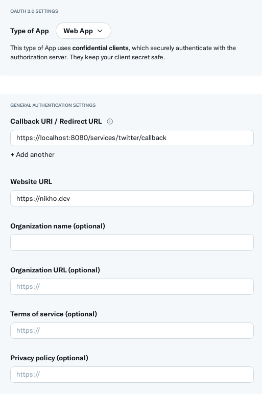

# Github

## Configuration

Before using GitHub action reactions, you need to create a GitHub developer application here:
https://github.com/settings/apps/new

write the name of your application and the home page url.
provide a callback url for your application and check

- 'Expire user authorization tokens'
- 'Request user authorization (OAuth) during installation'

in the webhooks section, check 'Active' and provide a valid webhook url (you can use a proxy client for localhost development) and put your webhook secret here



Now select these permissions:



And click on 'Create'.

Now create a '.env' or fill your own at root of server directory like example.env and add:

```
GITHUB_SERVICES_CLIENT_ID=Iv1.9a***********
GITHUB_SERVICES_SECRET=568822a5221c294******************
GITHUB_SERVICES_REDIRECT_URL=https://localhost:8081/services/github/callback
GITHUB_WEBHOOK_URL=https://smee.io/***********
GITHUB_WEBHOOK_SECRET=HELLOWORLD*******
```

# Discord

## Configuration

Before using discord action reactions, you need to create a discord developer application here:
https://discord.com/developers/applications

Go to OAuth2 tab and write your redirect url like `https://localhost:8081/services/discord/callback`



Click on URL Generator tab and select these scopes:

- identify
- email
- connections
- guilds
- bot
- messages.read
- activities.read

and select Administrator for the Bot Permissions. copy the generated url and keep it aside
`https://discord.com/api/oauth2/authorize?client_id=CLIENT_ID&permissions=8&redirect_uri=https://localhost:8081/services/discord/callback&response_type=code&scope=identify%20bot%20connections%20email%20activities.read%20messages.read%20guilds`

Now go to Bot tab, enable all authorization flow settings and privileged gateway intens. copy the bot token and keep it aside


Now create a '.env' or fill your own at root of server directory like example.env and add:

```dotenv
DISCORD_SERVICES_CLIENT_ID=9346*********
DISCORD_SERVICES_CLIENT_SECRET=eAHwmn0if********
DISCORD_SERVICES_REDIRECT_URL=https://localhost:8081/services/discord/callback
DISCORD_SERVICES_BOT_TOKEN=OTM0NjIxMDI1MjUyMDM2N******************
```

That all ! try to go to your authorize and check if everything is working


# Slack

## Configuration

Before using discord action reactions, you need to create a discord developer application here: https://api.slack.com/apps

Go to `OAuth & Permissions` :

- Add your redirect url in `Redirect URLs`
- Add scopes



- Install to workspace

Go to `Manage distribution` :



And activate Public Distribution

Now create a '.env' or fill your own at root of server directory like example.env and add:


```
SLACK_BOT_TOKEN=xoxb-29650***********
SLACK_SERVICES_CLIENT_ID=296505949*****************
SLACK_SERVICES_CLIENT_SECRET=14b7fdaf0**********
```

# Twitter

## Configuration

- Create an app
- Turned on OAuth 2.0



Now create a '.env' or fill your own at root of server directory like example.env and add:

```
TWITTER_SERVICES_CLIENT_ID=Mk1jNGl******************
TWITTER_SERVICES_CLIENT_SECRET=qrFejKycNfs_LOEA7*****
TWITTER_SERVICES_REDIRECT_URL=https://localhost:8080/********
```