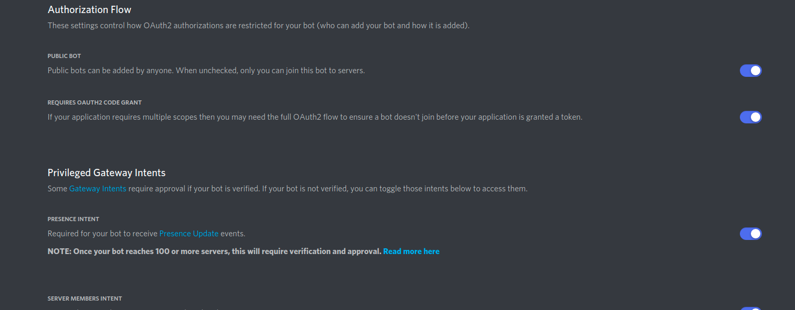

# Github

## Configuration

before using GitHub action reactions, you need to create a GitHub developer application here:
https://github.com/settings/apps/new

write the name of your application and the home page url.
provide a callback url for your application and check 

- 'Expire user authorization tokens'
- 'Request user authorization (OAuth) during installation'

in the webhooks section, check 'Active' and provide a valid webhook url (you can use a proxy client for localhost development) and put your webhook secret here


Now select these permissions:


And click on 'Create'. now generate a GitHub secret and write create a .env file in root/server and paste all GitHub information like this:

```dotenv
GITHUB_SERVICES_CLIENT_ID=Iv1.9a***********
GITHUB_SERVICES_SECRET=568822a5221c294******************
GITHUB_SERVICES_REDIRECT_URL=https://localhost:8081/services/github/callback
GITHUB_WEBHOOK_URL=https://smee.io/***********
GITHUB_WEBHOOK_SECRET=HELLOWORLD*******
```

# Discord

## Configuration

before using discord action reactions, you need to create a discord developer application here:
https://discord.com/developers/applications

Go to OAuth2 tab and write your redirect url like `https://localhost:8081/services/discord/callback`


Click on URL Generator tab and select these scopes:

- identify
- email
- connections
- guilds
- bot
- messages.read
- activities.read

and select Administrator for the Bot Permissions. copy the generated url and keep it aside
`https://discord.com/api/oauth2/authorize?client_id=CLIENT_ID&permissions=8&redirect_uri=https://localhost:8081/services/discord/callback&response_type=code&scope=identify%20bot%20connections%20email%20activities.read%20messages.read%20guilds`

now go to Bot tab, enable all authorization flow settings and privileged gateway intens. copy the bot token and keep it aside



now create a .env file in root/server and paste all discord information like this:

```dotenv
DISCORD_SERVICES_CLIENT_ID=9346*********
DISCORD_SERVICES_CLIENT_SECRET=eAHwmn0if********
DISCORD_SERVICES_REDIRECT_URL=https://localhost:8081/services/discord/callback
DISCORD_SERVICES_BOT_TOKEN=OTM0NjIxMDI1MjUyMDM2N******************
```

That all ! try to go to your authorize and check if everything is working
